# Container Lab
    without Docker create a container

We will build our own containers without using Docker.
We create two containers, **Haribo** and **Kimchi**, where resources are allocated via **cgroups** and connectivity is established through a **network namespace**.

Different applications require different server environments, which leads to high operational costs. To run applications independently of the underlying server infrastructure, we use **containers**. 

Containers provide a dedicated, isolated environment for applications through three key concepts
1. **Packaging**: Bundling the application with all its required dependencies, libraries, and binaries.
2. **Isolation**: Isolating the application's execution environment within the host server.
3. **Resource Guarantee**: Allocating and guaranteeing necessary resources such as CPU, memory, and network.

## Container Requirements
* **Linux**: The underlying core technology for containers.
* **Container Runtime**: The tool used to run and manage containers.

## option
* **Kubernetes (Container Orchestration)**: When managing multiple servers, we need an automation tool. Kubernetes automatically deploys, manages, and scales containers across a cluster of servers.

## Container and Host
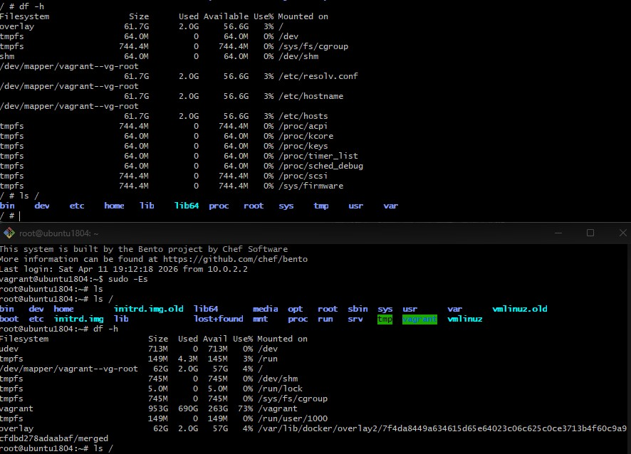

### Comparison: Container vs Host
* **Filesystem Differences**
    - The root's filesystem is different.
    - In the container root's filesystem is `overlay`
    - In the host root's filesystem is `/dev/mapper/...`

* **Process and Network Isolation**
    - Process and network are also different.
    - Try `ps -aux` and `ip a` in both container and host.
    - Try `hostname` in both container and host.

* **Question** 
    - ?? container's root and host's root are same?

## Container Filesystem

### 1. chroot (Change Root)
A technique used to isolate processes and enhance security on shared servers.

- **Concept**: It "cages" a process by changing its apparent root directory.

- **Fake Root**: Processes are restricted to a specific sub-directory, which they perceive as the actual root (`/`).
This "Fake Root" prevents malicious users from escaping their environment and accessing the host's sensitive files.

i did copy /bin/sh and /bin/ls to the fake root.
you can use 'ldd' command to check the dependencies of the copied files.
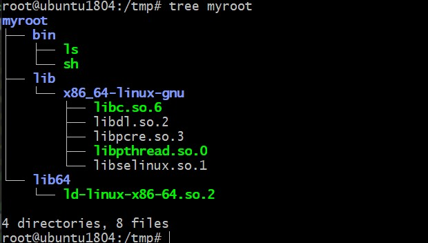

and then i put 'ls' command in the fake root, so it actually behaves like a root directory.
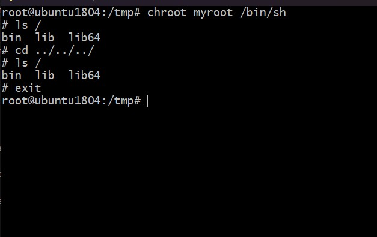

**package** and **isolation** those pattern is the basic of container.

### 2. mount

- **mount** : a command to attach a filesystem to a directory.
            - need a mount point.

 mount -t [type] [source] [target]

```
ex)
: mount -t ext4 /dev/sda1 /mnt/my-disk

type: ext4
source: /dev/sda1
target: /mnt/my-disk
```

i did it copy `/bin/ps` and `/bin/mount` to the fake root and tried to run it in the fake root.
but it failed. 
because we don't have a `/proc` directory so i made `/proc` directory in the fake root.

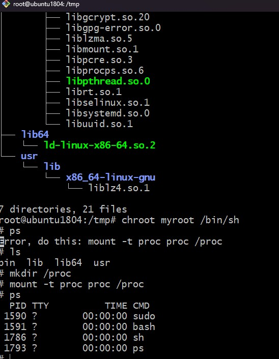

and then i did `umount /tmp/my-root/proc`, unmounting is necessary to clean up system resources.

Manually packaging the environment every time is difficult and tedious, which is why we use **Docker Images**.

so i gonna use nginx image and chroot
```
mkdir nginx-root;
docker export $(docker create nginx) | tar -x -C nginx-root -xvf -;
chroot nginx-root /bin/sh
```

exoprt $(docker create nginx) : Create an nginx container and stream its entire root filesystem as a tar.

tar -x : Extract.

-C : Change directory.

### pivot root
but can be escaped from chroot.
so we have to use pivot root to change root filesystem in a container.

### namespace
    namespace : isolate a process
        - "mount enviroment isolation!"
        - process / network / file / permission isolation

### mount namespace
    mount point isolation
    `unshare` -> create a new namespace and copy parent's mount space resources to child mount space.
    - The parent process cannot see filesystems mounted within the child's namespace.
    - The child process can see filesystems that were mounted by the parent.

first `unshare --mount /bin/sh` and then
i did it `mkdir new_root`
and then `mount -t tmpfs none new_root` on both host and container.
and `mount | grep new_root` 
i can see it only on container.

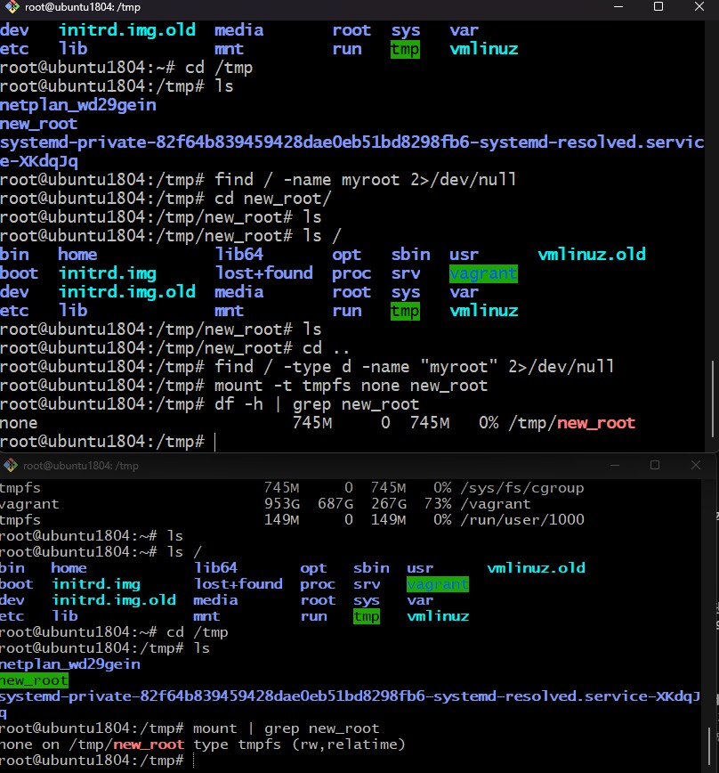

`mkdir new_root/old_root`

now we can **pivot root**

`cd new_root` -> `pivot_root . old_root` -> `cd /`
now we can change root filesystem in a container.

but there's still a **redundancy** issue.
If the base OS is 1GB, you would have to copy the entire 1GB+α every time you add a new service (like a web server).
This leads to significant storage waste and management overhead.
This inefficiency is the primary reason why Docker utilizes a **Overlay File System**.

### Overlay File System
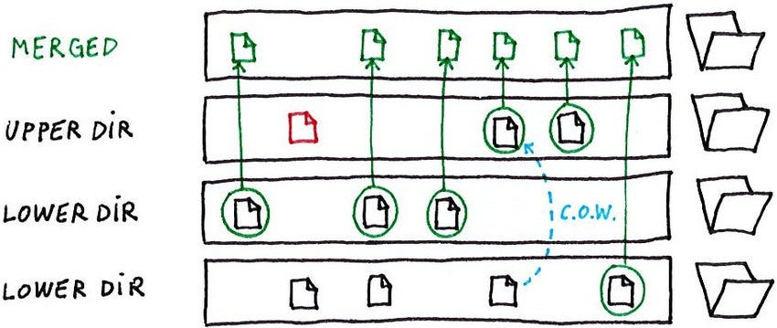

```
**lower dir** : read only
**upper dir** : write
**merged dir** : read and write
**cow** : copy on write (maintain original state)
```
so i gonna use myroot as lower dir and also tools dir as lower dir.
in tools dir i put rm and which.
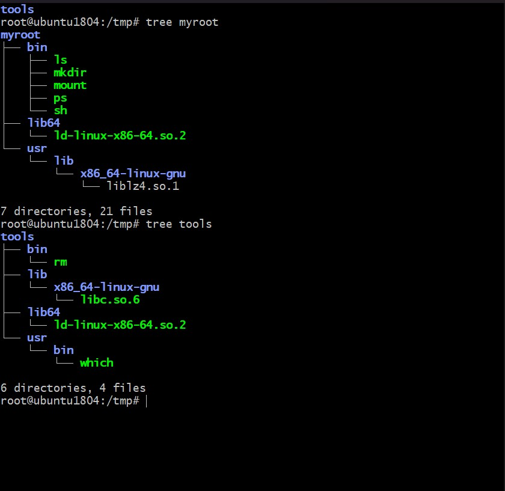

and then i made rootfs
```
container as a upper dir
merge as a merged dir
work is for update

`mount -t overlay overlay -o lowerdir=tools:myroot,upperdir=rootfs/container,workdir=rootfs/work rootfs/merge`
```

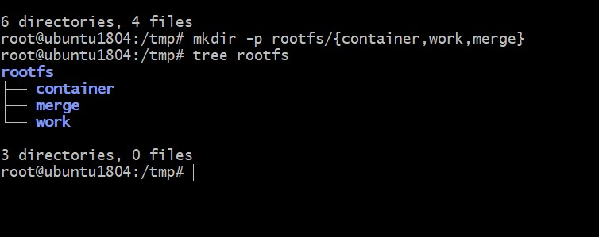


we can check merged dir.

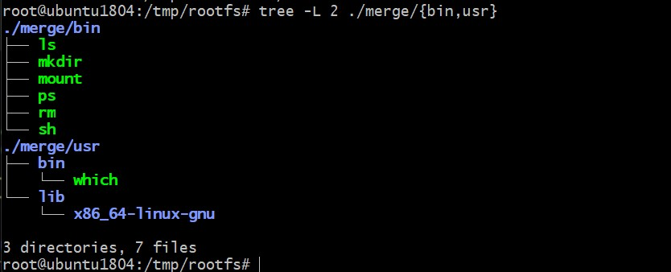

but here we can see other process running on the host. 
and in the container use the port of host.
and container has root's permission.

To solve these isolation problems, several types of namespaces were introduced

# namespace
    - All processes belong to a namespace for each resource type (Mount, PID, Network, etc.).
    - By default, all host processes share the same **Initial/Default Namespaces**.
    - Creating a container means "unsharing" or creating **new namespaces** (IDs) for a process to isolate its resources from others.
    - You can check the current namespaces of a process at `/proc/[pid]/ns/` or `lsns -t pid -p [pid]`
    - child process inherit parent's namespace.

### PID namespace
    -PID isolation!
    - **Nested Hierarchy**: The host 'envelops' the container, allowing it to see everything inside, while the container remains completely unaware of its own isolation.
    - **Visibility**: The parent namespace has full visibility into child processes, but the child is oblivious to the host environment.    
### PID 1
    -init process(kernel make)
    -signal handler
    -zombie, orphaned process handler
    -if PID 1 is killed, all process are killed.

### container PID 1 
    - When using `unshare --pid --fork`, the first child process created after the unshare system call becomes **PID 1** within the new child namespace.
    - This process acts as the **init process** for the container, responsible for reaping zombie processes and handling signals.
    - If this PID 1 process terminates, all other processes within the namespace are also terminated by the kernel.

### Creating a process-isolated shell
```
unshare -fp --mount-proc /bin/sh

- `-p`: Unshares the PID namespace.
- `-f`: Forks the shell into the new namespace as PID 1.
- `--mount-proc`: Mounts a fresh `/proc` filesystem so that tools like `ps` only show processes within the container.
- `/bin/sh`: The target shell to run in isolation.
```
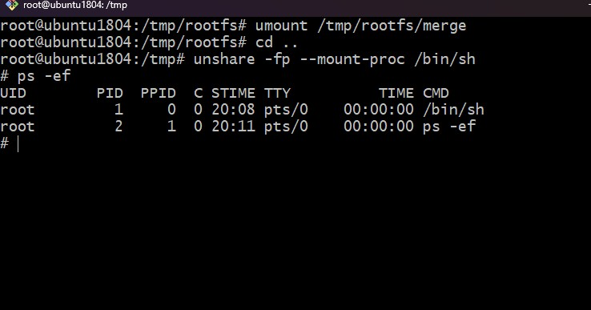

### Network namespace
    - Network isolation!
    - Network virtual, use virtual interface 

#### Network Interface
    - can't be shared between namespaces
    - can be moved between namespaces
    ex ) veth, bridge,vxlan...
    - when the Network namespace is deleted, all network interface in the namespace are deleted.

### Network namespace
    - UID/GID numberspace isolation
    - solve container root's permission.
    - UID/GID remap (parent UID = 1000 --> child Uid = 0)

# Cgroups
    -Control Groups : 컨테이너별로 자원을 분배하고 limit 내에서 운용.
    ** 하나의 또는 복수 장치를 묶어서 그룹
    ** 프로세스가 사용하는 리소스 통제
    ** 네임스페이스로 격리가능.

# Make Container!
### Network Setting
in order to make container i added some files in the tool directory.

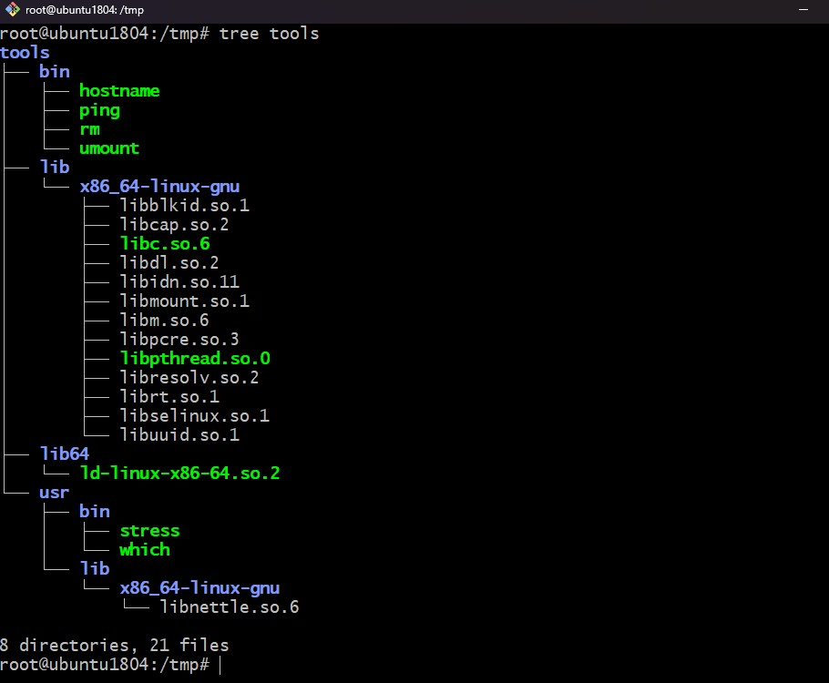

ip netns add KIMCHI;
ip netns add HARIBO;

ip link add veth0 netns KIMCHI type veth peer name veth1 netns HARIBO;
ip netns exec KIMCHI ip l;
ip netns exec HARIBO ip l;
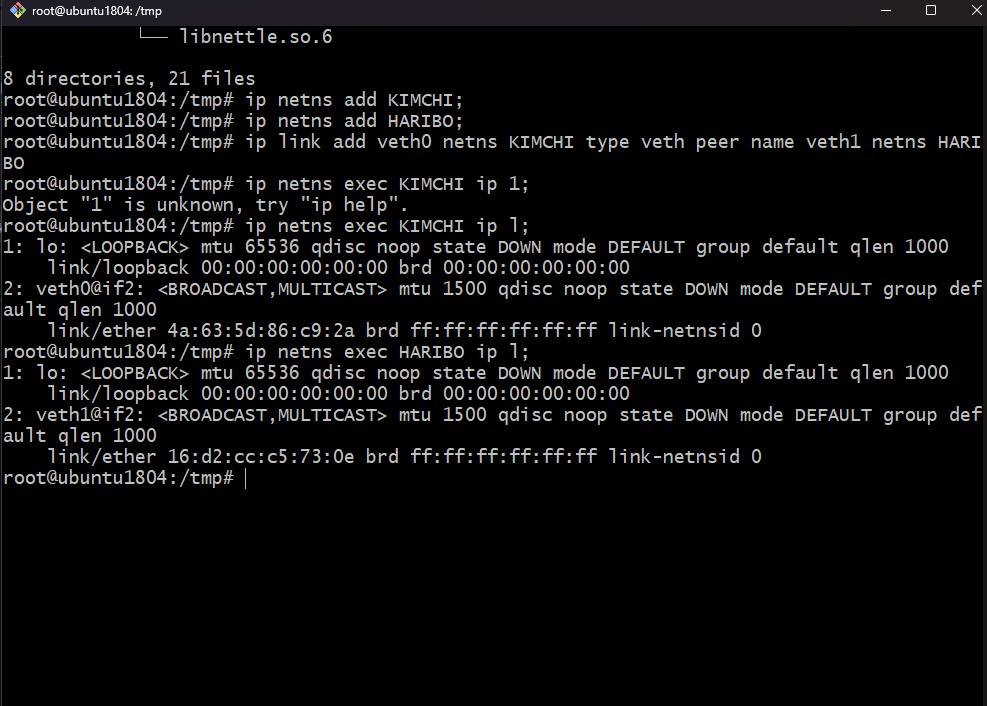

ip netns exec KIMCHI ip addr add dev veth0 11.11.11.2/24;
ip netns exec HARIBO ip addr add dev veth1 11.11.11.3/24;

ip netns exec KIMCHI ip link set veth0 up;
ip netns exec HARIBO ip link set veth1 up;

이 네트워크는 /var/run/netns 밑에 파일로 관리됨.

ls /var/run/netns 입력하면 KIMCHI, HARIBO가 보임.

이제 현재까지 container network는 준비가 됨.


### 이제 resources를 할당해보자. cgroup!

mkdir /sys/fs/cgroup/cpu/KIMCHI
mkdir /sys/fs/cgroup/memory/KIMCHI

ls /sys/fs/cgroup/cpu/KIMCHI
ls /sys/fs/cgroup/memory/KIMCHI

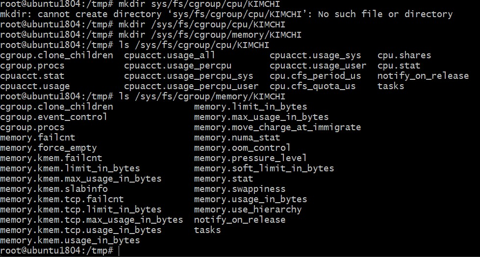


### cgroup configuration
cpu 40 %, memory 200MB, swappiness 메모리가 모자랄 경우에 메모리 에있는 내용을 디스크로 쓰는데 그정도를 0으로 설정.

echo 40000 > /sys/fs/cgroup/cpu/KIMCHI/cpu.cfs_quota_us;
echo 209715200 > /sys/fs/cgroup/memory/KIMCHI/memory.limit_in_bytes;
echo 0 > /sys/fs/cgroup/memory/KIMCHI/memory.swappiness;

cat명령어로 확인가능.

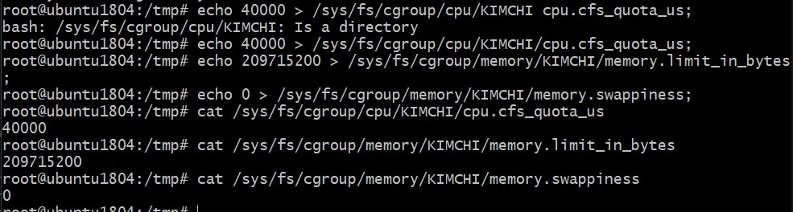


### KIMCHI container isolation!
unshare -m -u -i -fp nsenter --net=/var/run/netns/KIMCHI /bin/sh;
- u : UTS 호스트이름을 격리
- i :IPC 프로세스간 통신 공간을 격리
- p : PID 프로세스 id 격리
- f fork 자식프로세스 만들어 프로세스 격리
nsenter --net=/var/run/netns/KIMCHI : 기존 네트워크 연결.

### KIMCHI container cgroup assign
container 프로세르에 cgroup 할당.
echo "1" > /sys/fs/cgroup/cpu/KIMCHI/cgroup.procs;
echo "1" > /sys/fs/cgroup/memory/KIMCHI/cgroup.procs;

### KIMCHI container fs overlay

mkdir /kimchifs
mkdir /kimchifs/container
mkdir /kimchifs/work
mkdir /kimchifs/merge

mount -t overlay overlay -o lowerdir=/tmp/tools:/tmp/myroot,upperdir=/kimchifs/container,workdir=/kimchifs/work /kimchifs/merge


mount -t overlay overlay -o lowerdir=/tmp/tools:/tmp/myroot,upperdir=/haribofs/container,workdir=/haribofs/work /haribofs/merge

tree /kimchifs/merge

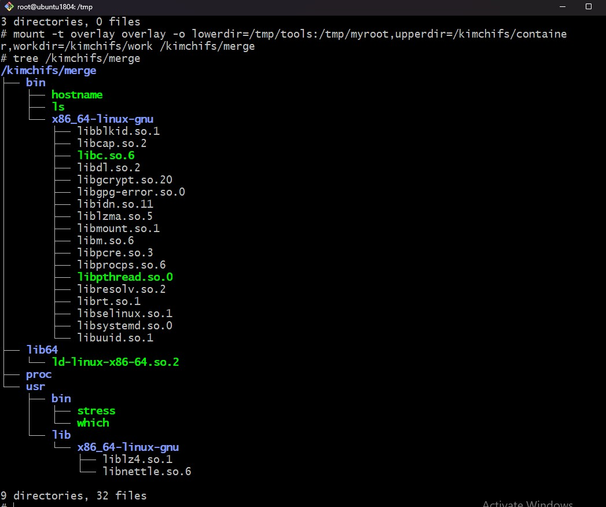

### KIMCHI container pivotroot!
mkdir -p /kimchifs/merge/old_root
cd /kimchifs/merge
pivot_root . old_root
cd /;

mount -t proc proc /proc;
umount -l old_root
rm -rf old_root

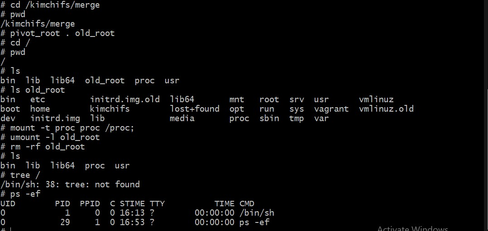

as same as KIMCHI, HARIBO container is made.

### Test KIMCHI/HARIBO ping 
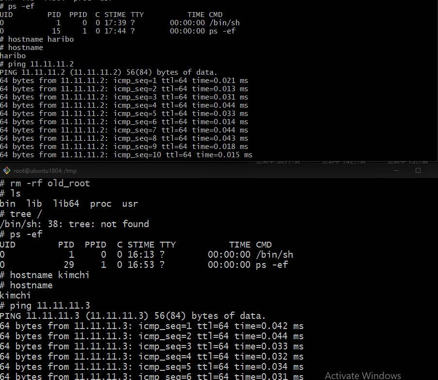

### Test stress
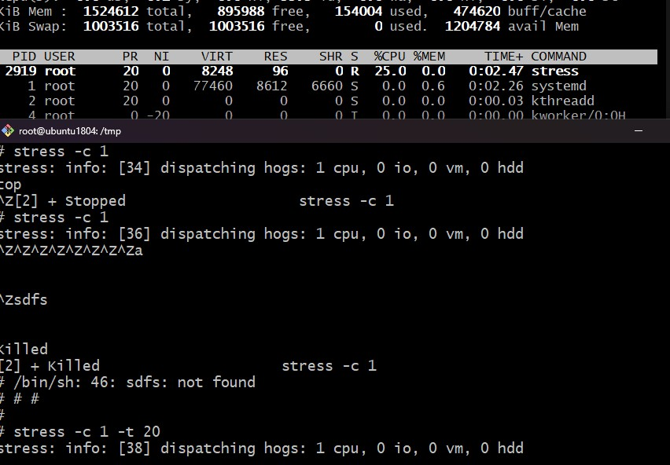